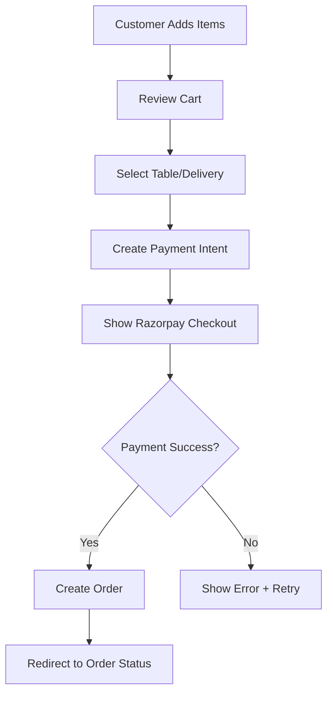

# Customer QR Ordering & Razorpay Payment System Implementation Plan

## 🎯 **OBJECTIVE**
Complete the customer QR ordering system with a robust cart, Razorpay payment integration, webhook handling, and automatic restaurant settlement.

---

## 📋 **CURRENT STATE ANALYSIS**

### ✅ **What's Already Working**
- Basic customer menu browsing (`/c/:slug`)
- QR code generation for tables
- Razorpay service with order creation
- Webhook controller setup
- Order status tracking
- Basic cart functionality in CustomerMenuPage

### ❌ **What's Missing/Incomplete**
- Proper cart persistence across page reloads
- Enhanced cart UI with item modifications
- Payment flow integration with order creation
- Comprehensive webhook event handling
- Automatic settlement to restaurants
- Error handling and retry mechanisms
- Payment status synchronization

---

## 🏗️ **IMPLEMENTATION PHASES**

## **PHASE 1: Enhanced Cart System (Week 1)**

### 1.1 Frontend Cart Improvements
```typescript
// Location: apps/frontend/src/store/slices/cartSlice.ts
- Implement Redux cart state management
- Add cart persistence with localStorage
- Handle item modifications (quantity, variants, addons)
- Calculate totals, taxes, and discounts
- Cart validation before checkout
```

### 1.2 Cart UI Components
```typescript
// Location: apps/frontend/src/components/customer/cart/
- CartDrawer.tsx - Sliding cart overlay
- CartItem.tsx - Individual cart item with controls
- CartSummary.tsx - Price breakdown
- CartValidation.tsx - Order validation messages
```

### 1.3 Menu Item Enhancements
```typescript
// Location: apps/frontend/src/components/customer/menu/
- MenuItemCard.tsx - Enhanced with variants/addons
- ItemCustomization.tsx - Addon/variant selection
- QuantitySelector.tsx - Better quantity controls
```

**Deliverables:**
- Persistent cart across page reloads
- Item customization with addons/variants
- Real-time price calculations
- Cart validation (min order, availability)

---

## **PHASE 2: Razorpay Payment Integration (Week 2)**

### 2.1 Backend Order & Payment Flow
```typescript
// Location: apps/backend/src/orders/
- Update CreateOrderDto with payment intent
- Add payment_status field to Order schema
- Create payment session before order confirmation
- Handle payment_pending → payment_confirmed flow
```

### 2.2 Frontend Payment Integration
```typescript
// Location: apps/frontend/src/components/customer/payment/
- PaymentGateway.tsx - Razorpay integration component
- PaymentOptions.tsx - UPI, Cards, Wallets selection
- PaymentStatus.tsx - Real-time payment tracking
- PaymentError.tsx - Error handling and retry
```

### 2.3 Order Creation Flow


**Deliverables:**
- Razorpay checkout integration
- Payment intent creation
- Order creation only after payment confirmation
- Error handling with retry options

---

## **PHASE 3: Webhook & Settlement System (Week 3)**

### 3.1 Enhanced Webhook Processing
```typescript
// Location: apps/backend/src/payments/webhooks.controller.ts
- Handle payment.captured events
- Handle payment.failed events
- Handle transfer.processed events
- Implement idempotency for duplicate webhooks
- Add comprehensive logging and monitoring
```

### 3.2 Restaurant Settlement System
```typescript
// Location: apps/backend/src/payments/settlement.service.ts
- Calculate restaurant share (after platform fee)
- Create automatic transfers to restaurant accounts
- Handle settlement scheduling (daily/weekly)
- Track settlement history and status
```

### 3.3 Payment Status Synchronization
```typescript
// Location: apps/backend/src/orders/orders.service.ts
- Update order status based on payment events
- Send notifications to kitchen/restaurant
- Handle payment failures and refunds
- Implement payment reconciliation
```

**Deliverables:**
- Robust webhook handling with retry logic
- Automatic restaurant settlements
- Payment status synchronization
- Settlement tracking and reporting

---

## **PHASE 4: Customer Experience & Edge Cases (Week 4)**

### 4.1 Real-time Order Updates
```typescript
// Location: apps/frontend/src/pages/customer/CustomerOrderStatusPage.tsx
- WebSocket connection for live updates
- Order status progression (Paid → Preparing → Ready → Completed)
- Estimated preparation time
- Kitchen notifications integration
```

### 4.2 Edge Case Handling
```typescript
- Payment timeout scenarios
- Network failure during payment
- Duplicate order prevention
- Cart expiration handling
- Restaurant availability checks
```

### 4.3 Customer Support Features
```typescript
// Location: apps/frontend/src/components/customer/support/
- OrderIssues.tsx - Report payment/order issues
- RefundRequest.tsx - Request refund interface
- ContactSupport.tsx - Chat/email support
```

**Deliverables:**
- Real-time order tracking
- Comprehensive error handling
- Customer support interfaces
- Payment issue resolution

---

## 🔧 **TECHNICAL SPECIFICATIONS**

### Payment Flow Architecture
```typescript
// 1. Order Creation with Payment Intent
POST /api/restaurants/:restaurantId/orders/create-with-payment
{
  items: CartItem[],
  tableNumber?: number,
  customerInfo: CustomerDetails,
  totalAmount: number
}
Response: {
  orderId: string,
  razorpayOrderId: string,
  amount: number,
  currency: 'INR'
}

// 2. Payment Verification
POST /api/orders/:orderId/verify-payment
{
  razorpay_payment_id: string,
  razorpay_order_id: string,
  razorpay_signature: string
}

// 3. Webhook Processing
POST /webhooks/razorpay
{
  event: 'payment.captured' | 'payment.failed' | 'transfer.processed',
  payload: RazorpayWebhookPayload
}
```

### Database Schema Updates
```sql
-- Orders table updates
ALTER TABLE orders ADD COLUMN payment_intent_id VARCHAR;
ALTER TABLE orders ADD COLUMN payment_status ENUM('pending', 'captured', 'failed', 'refunded');
ALTER TABLE orders ADD COLUMN razorpay_order_id VARCHAR;
ALTER TABLE orders ADD COLUMN razorpay_payment_id VARCHAR;

-- Settlement tracking
CREATE TABLE restaurant_settlements (
  id SERIAL PRIMARY KEY,
  restaurant_id VARCHAR NOT NULL,
  order_ids VARCHAR[] NOT NULL,
  total_amount DECIMAL(10,2) NOT NULL,
  platform_fee DECIMAL(10,2) NOT NULL,
  settlement_amount DECIMAL(10,2) NOT NULL,
  razorpay_transfer_id VARCHAR,
  status ENUM('pending', 'processed', 'failed') DEFAULT 'pending',
  scheduled_at TIMESTAMP,
  processed_at TIMESTAMP,
  created_at TIMESTAMP DEFAULT NOW()
);
```

---

## 📊 **SUCCESS METRICS**

### Performance Targets
- Payment success rate: > 95%
- Checkout completion rate: > 80%
- Webhook processing time: < 2 seconds
- Settlement accuracy: 100%
- Customer support tickets: < 5% of orders

### Monitoring & Alerts
- Payment failure alerts
- Webhook processing failures
- Settlement delays
- High cart abandonment rates
- API response time monitoring

---

## 🚀 **IMPLEMENTATION PRIORITY**

### Week 1: Cart System ⭐⭐⭐
**Critical** - Foundation for everything else

### Week 2: Payment Integration ⭐⭐⭐
**Critical** - Core revenue generation

### Week 3: Webhooks & Settlement ⭐⭐
**High** - Business operations

### Week 4: UX & Edge Cases ⭐
**Medium** - Customer satisfaction

---

## 🔒 **SECURITY CONSIDERATIONS**

1. **Payment Security**
   - Webhook signature verification
   - HTTPS-only communication
   - PCI DSS compliance considerations
   - Sensitive data encryption

2. **Order Security**
   - Prevent duplicate orders
   - Validate order amounts
   - Rate limiting on order creation
   - Input sanitization

3. **Settlement Security**
   - Verify transfer amounts
   - Audit trail for all settlements
   - Secure API key management
   - Fraud detection mechanisms

---

## 📝 **TESTING STRATEGY**

1. **Unit Tests**
   - Cart calculations
   - Payment verification
   - Webhook processing
   - Settlement calculations

2. **Integration Tests**
   - End-to-end payment flow
   - Webhook event handling
   - Order status updates
   - Settlement processing

3. **Load Testing**
   - High-volume order creation
   - Webhook processing capacity
   - Payment gateway limits
   - Database performance

---

## 🎉 **EXPECTED OUTCOMES**

After completion, the system will provide:

✅ **Seamless Customer Experience**
- Quick QR-based ordering
- Smooth payment process
- Real-time order tracking

✅ **Reliable Payment Processing**
- High payment success rates
- Automatic retry mechanisms
- Comprehensive error handling

✅ **Automated Business Operations**
- Automatic restaurant settlements
- Real-time payment reconciliation
- Detailed financial reporting

✅ **Production-Ready Quality**
- Robust error handling
- Comprehensive monitoring
- Security best practices

This implementation will make your POS system fully production-ready for restaurant customers and provide a solid foundation for scaling to multiple locations.