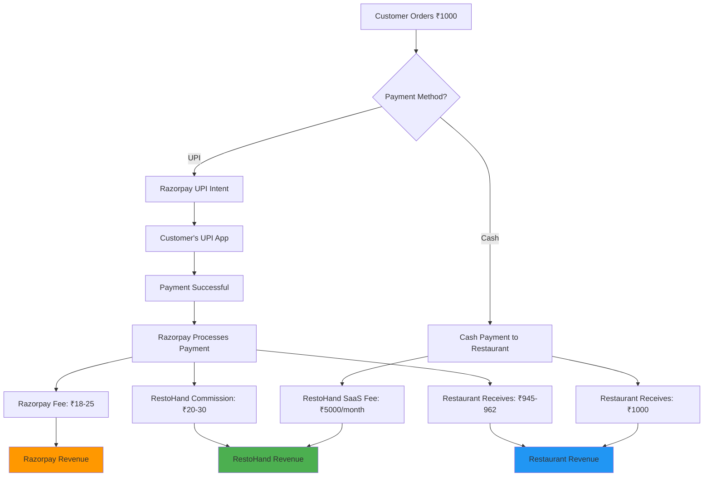

# RestoHand Money Flow Architecture

## Primary Revenue Streams

### 1. SaaS Subscription Model
```
Restaurant → Monthly/Annual Fee → RestoHand
₹2,000-10,000/month per restaurant
```

### 2. Transaction Fee Model
```
Customer Payment → Razorpay → RestoHand Commission → Restaurant
2-3% transaction fee on digital payments
```

### 3. Premium Features
```
Restaurant → Feature Upgrade Fee → RestoHand
Analytics, Multi-location, Advanced reports
```

## Payment Flow Diagram



## Revenue Calculation Example

### Monthly Revenue per Restaurant
- **SaaS Fee**: ₹5,000/month
- **Transaction Volume**: ₹2,00,000/month
- **Digital Payment %**: 70% = ₹1,40,000
- **Commission (2%)**: ₹2,800/month
- **Total Revenue**: ₹7,800/month per restaurant

### Scale Projections
- **100 Restaurants**: ₹7.8 lakhs/month
- **500 Restaurants**: ₹39 lakhs/month
- **1000 Restaurants**: ₹78 lakhs/month

## Cost Structure
- **Technology Infrastructure**: ₹2-3 lakhs/month
- **Payment Processing**: 1.8% to Razorpay
- **Customer Support**: ₹5-8 lakhs/month
- **Sales & Marketing**: 30-40% of revenue