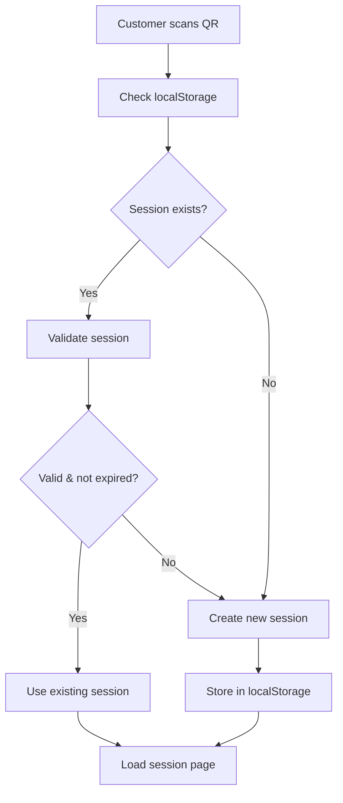
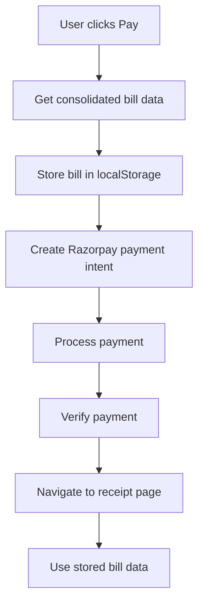
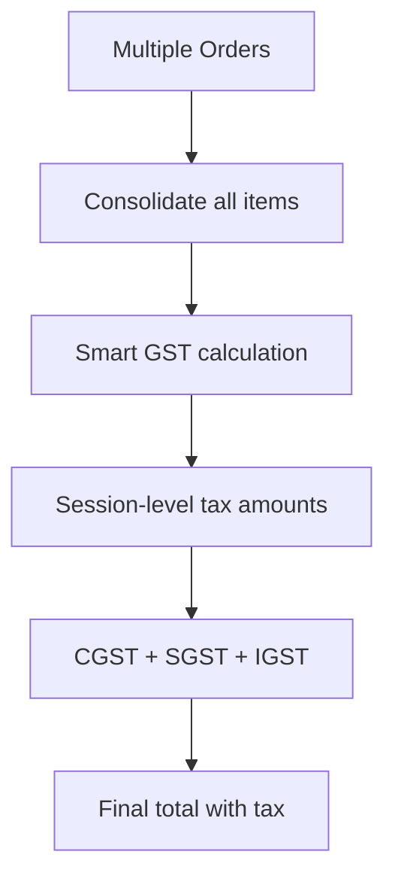

# Customer Session Management System

## Overview

The RestoHand customer session management system provides a comprehensive solution for handling multi-customer table sessions, payment processing, and receipt generation. This system ensures proper isolation between customers at the same table and implements industry-standard session-based billing similar to Toast, Square, and other professional POS systems.

## Architecture

### 1. Frontend Session Management

#### Local Storage Strategy
The frontend uses browser localStorage to maintain session continuity and handle post-payment receipt display:

```javascript
// Session Creation & Persistence
localStorage.setItem('customerSession', JSON.stringify({
  sessionId: 'uuid-session-id',
  tableId: 'table-object-id',
  slug: 'restaurant-slug',
  timestamp: new Date().toISOString(),
  expiry: 4 * 60 * 60 * 1000 // 4 hours
}));

// Post-Payment Bill Storage
localStorage.setItem('lastPaymentSession', JSON.stringify({
  slug,
  tableId,
  orderIds: paymentData.orderIds,
  totalAmount: paymentData.totalAmount,
  billData: consolidatedBillData, // Complete bill for receipt page
  timestamp: new Date().toISOString()
}));
```

#### Session Validation
- **Automatic expiry**: Sessions expire after 4 hours of inactivity
- **Data validation**: Checks for session existence and validity on page load
- **Graceful fallback**: Creates new session if existing one is invalid/expired

### 2. Backend Session Architecture

#### Database Schema (MongoDB)

**Customer Session Collection:**
```javascript
// CustomerSession Schema
{
  _id: ObjectId,
  sessionId: String, // UUID for session identification
  restaurantId: ObjectId,
  tableId: ObjectId,
  status: String, // 'active' | 'completed' | 'expired'
  createdAt: Date,
  lastActivity: Date,
  expiresAt: Date, // TTL index for automatic cleanup
}
```

**Enhanced Order Schema:**
```javascript
// Order Schema with Session Reference
{
  _id: ObjectId,
  customerSessionId: String, // Links to customer session
  restaurantId: ObjectId,
  tableId: ObjectId,
  orderNumber: String,
  items: [...],
  totalAmount: Number,
  paymentStatus: String,
  // ... other fields
}
```

#### Express Session Configuration
```javascript
// Session middleware setup in main.ts
app.use(session({
  secret: process.env.SESSION_SECRET,
  resave: false,
  saveUninitialized: false,
  store: new MongoStore({
    mongoUrl: process.env.DATABASE_URL,
    ttl: 4 * 60 * 60 // 4 hour expiry
  }),
  cookie: {
    secure: process.env.NODE_ENV === 'production',
    httpOnly: true,
    maxAge: 4 * 60 * 60 * 1000 // 4 hours
  }
}));
```

### 3. Session-Level Tax Calculation

#### Smart GST Integration
The system calculates taxes at the session level (not individual orders) using the Smart GST service:

```javascript
// Consolidated tax calculation
const consolidatedItems = [];
for (const order of orders) {
  for (const item of order.items) {
    consolidatedItems.push({
      menuItemId: item.menuItemId.toString(),
      name: item.name,
      quantity: item.quantity,
      unitPrice: item.pricing.unitAmount,
      discountAmount: item.pricing.discountAmount || 0,
    });
  }
}

const taxCalculation = await this.smartGstService.calculateOrderGst(
  restaurantId,
  consolidatedItems,
  customerState
);
```

## API Endpoints

### Session Management APIs

#### Create Customer Session
```http
POST /api/public/restaurants/:slug/table/:tableId/session
```
Creates a new customer session with UUID-based session ID.

#### Get Table Session
```http
GET /api/public/restaurants/:slug/session?tableId=:tableId
```
Retrieves current table session with all orders and calculated totals.

#### Get Consolidated Bill
```http
GET /api/public/restaurants/:slug/table/:tableId/consolidated-bill
```
Returns complete bill data with session-level tax calculations.

### Payment APIs

#### Create Session Payment Intent
```http
POST /api/public/restaurants/:slug/table/:tableId/session/payment-intent
```
Creates Razorpay payment intent for entire session (all unpaid orders).

## Frontend Components

### 1. CustomerTableSessionPage
**Primary session management component:**
- Displays real-time order status for entire table
- Shows consolidated bill with tax breakdown
- Handles session-level payment processing
- Provides thermal receipt PDF download

### 2. CustomerReceiptPage
**Post-payment receipt display:**
- Uses stored bill data from localStorage
- Shows payment success confirmation
- Provides PDF download functionality
- Handles session data expiry gracefully

### 3. ThermalReceiptPDF Component
**Professional receipt generation:**
- 58mm thermal printer width (industry standard)
- Courier monospace font for authentic POS look
- Session-level tax breakdown display
- Instant browser-based PDF generation

## Session Flow

### 1. Session Creation


### 2. Payment Processing


### 3. Tax Calculation


## Key Features

### ✅ Session Isolation
- **UUID-based sessions** prevent customer data mixing
- **Table-level grouping** allows multiple customers per table
- **Automatic expiry** cleans up old sessions

### ✅ Industry-Standard Billing
- **Session-level tax calculation** (like Toast/Square)
- **Consolidated payment processing** for entire table
- **Professional thermal receipt** generation

### ✅ Robust Error Handling
- **localStorage fallback** for post-payment receipts
- **Graceful session recovery** from expired states
- **Real-time order updates** via WebSocket connections

### ✅ Performance Optimization
- **Frontend PDF generation** (no backend processing)
- **RTK Query caching** for API responses
- **Efficient session storage** with TTL indexes

## Data Flow

### Session Data Structure
```javascript
// Frontend Session State
{
  sessionId: "550e8400-e29b-41d4-a716-446655440000",
  tableId: "60d5ec49f1b2c8b1f8e4e1a0",
  orders: [
    {
      id: "order-id-1",
      orderNumber: "rest-001",
      items: [...],
      totalAmount: 150.00,
      paymentStatus: "pending"
    }
  ],
  totals: {
    subTotalAmount: 150.00,
    taxAmount: 7.50,
    cgstAmount: 3.75,
    sgstAmount: 3.75,
    totalAmount: 157.50
  },
  hasUnpaidOrders: true,
  allOrdersPaid: false
}
```

## Security Considerations

### ✅ Session Security
- **UUID session IDs** prevent session hijacking
- **HttpOnly cookies** for backend session storage
- **Secure flag** enabled in production
- **Automatic session expiry** prevents stale sessions

### ✅ Payment Security
- **No sensitive data** stored in localStorage
- **Razorpay integration** handles payment processing
- **Server-side payment verification** ensures authenticity

## Deployment Notes

### Environment Variables
```bash
SESSION_SECRET=your-strong-session-secret
DATABASE_URL=mongodb://localhost:27017/restohand
NODE_ENV=production
```

### MongoDB Indexes
```javascript
// Required indexes for optimal performance
db.customersessions.createIndex({ "sessionId": 1 }, { unique: true })
db.customersessions.createIndex({ "expiresAt": 1 }, { expireAfterSeconds: 0 })
db.orders.createIndex({ "customerSessionId": 1 })
db.orders.createIndex({ "tableId": 1, "customerSessionId": 1 })
```

## Future Enhancements

### Potential Improvements
1. **Redis Integration**: Replace memory store with Redis for production scaling
2. **WebSocket Real-time**: Enhanced real-time updates for order status
3. **Session Analytics**: Track session duration and customer behavior
4. **Multi-language Support**: Localized receipt generation

### Scaling Considerations
- **Horizontal scaling**: Redis session store for multi-instance deployment
- **Load balancing**: Session affinity or distributed session storage
- **Database optimization**: Proper indexing and query optimization

## Conclusion

The customer session management system provides a robust, scalable solution for restaurant table management with proper customer isolation, industry-standard billing practices, and professional receipt generation. The combination of frontend localStorage caching and backend session management ensures a smooth user experience while maintaining data integrity and security.